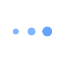

# Spinners

This package has two indeterminate progress spinners, one with lines:

<picture>
<svg stroke="currentColor" height="64" viewBox="0 0 64 64"><g stroke-width="4" stroke-linecap="round"><line y1="12" y2="20" transform="translate(32,32) rotate(180)"><animate attributeName="stroke-opacity" dur="750ms" values="1;.85;.7;.65;.55;.45;.35;.25;.15;.1;0;1" repeatCount="indefinite"></animate></line><line y1="12" y2="20" transform="translate(32,32) rotate(210)"><animate attributeName="stroke-opacity" dur="750ms" values="0;1;.85;.7;.65;.55;.45;.35;.25;.15;.1;0" repeatCount="indefinite"></animate></line><line y1="12" y2="20" transform="translate(32,32) rotate(240)"><animate attributeName="stroke-opacity" dur="750ms" values=".1;0;1;.85;.7;.65;.55;.45;.35;.25;.15;.1" repeatCount="indefinite"></animate></line><line y1="12" y2="20" transform="translate(32,32) rotate(270)"><animate attributeName="stroke-opacity" dur="750ms" values=".15;.1;0;1;.85;.7;.65;.55;.45;.35;.25;.15" repeatCount="indefinite"></animate></line><line y1="12" y2="20" transform="translate(32,32) rotate(300)"><animate attributeName="stroke-opacity" dur="750ms" values=".25;.15;.1;0;1;.85;.7;.65;.55;.45;.35;.25" repeatCount="indefinite"></animate></line><line y1="12" y2="20" transform="translate(32,32) rotate(330)"><animate attributeName="stroke-opacity" dur="750ms" values=".35;.25;.15;.1;0;1;.85;.7;.65;.55;.45;.35" repeatCount="indefinite"></animate></line><line y1="12" y2="20" transform="translate(32,32) rotate(0)"><animate attributeName="stroke-opacity" dur="750ms" values=".45;.35;.25;.15;.1;0;1;.85;.7;.65;.55;.45" repeatCount="indefinite"></animate></line><line y1="12" y2="20" transform="translate(32,32) rotate(30)"><animate attributeName="stroke-opacity" dur="750ms" values=".55;.45;.35;.25;.15;.1;0;1;.85;.7;.65;.55" repeatCount="indefinite"></animate></line><line y1="12" y2="20" transform="translate(32,32) rotate(60)"><animate attributeName="stroke-opacity" dur="750ms" values=".65;.55;.45;.35;.25;.15;.1;0;1;.85;.7;.65" repeatCount="indefinite"></animate></line><line y1="12" y2="20" transform="translate(32,32) rotate(90)"><animate attributeName="stroke-opacity" dur="750ms" values=".7;.65;.55;.45;.35;.25;.15;.1;0;1;.85;.7" repeatCount="indefinite"></animate></line><line y1="12" y2="20" transform="translate(32,32) rotate(120)"><animate attributeName="stroke-opacity" dur="750ms" values=".85;.7;.65;.55;.45;.35;.25;.15;.1;0;1;.85" repeatCount="indefinite"></animate></line><line y1="12" y2="20" transform="translate(32,32) rotate(150)"><animate attributeName="stroke-opacity" dur="750ms" values="1;.85;.7;.65;.55;.45;.35;.25;.15;.1;0;1" repeatCount="indefinite"></animate></line></g><foreignObject></foreignObject></svg>
</picture>

…and the other with dots:

<svg fill="currentColor" height="64" viewBox="0 0 64 64"><g><circle cx="16" cy="32" stroke-width="0"><animate attributeName="fill-opacity" dur="750ms" values=".5;.6;.8;1;.8;.6;.5;.5" repeatCount="indefinite"></animate><animate attributeName="r" dur="750ms" values="3;3;4;5;6;5;4;3" repeatCount="indefinite"></animate></circle><circle cx="32" cy="32" stroke-width="0"><animate attributeName="fill-opacity" dur="750ms" values=".5;.5;.6;.8;1;.8;.6;.5" repeatCount="indefinite"></animate><animate attributeName="r" dur="750ms" values="4;3;3;4;5;6;5;4" repeatCount="indefinite"></animate></circle><circle cx="48" cy="32" stroke-width="0"><animate attributeName="fill-opacity" dur="750ms" values=".6;.5;.5;.6;.8;1;.8;.6" repeatCount="indefinite"></animate><animate attributeName="r" dur="750ms" values="5;4;3;3;4;5;6;5" repeatCount="indefinite"></animate></circle></g><foreignObject></foreignObject></svg>

They are [animated SVGs](https://developer.mozilla.org/en-US/docs/Web/SVG/Element/animate) from [Ionic Framework](https://ionicframework.com/docs/api/spinner).

## Why?

Because sometimes you just need a simple spinner without a 5-tonne framework attached.

## Usage

### Just the SVGs

If you just want the SVGs, you can grab them below (right click and save):

  - [Lines](https://raw.githubusercontent.com/small-tech/spinners/main/lines.svg)
  - [Dots](https://raw.githubusercontent.com/small-tech/spinners/main/dots.svg)

<details>
  <summary><strong>SVG code (copy and paste)</strong></summary>

  #### Lines:

  ```svg
  <svg stroke="currentColor" height="1em" viewBox="0 0 64 64"><g stroke-width="4" stroke-linecap="round"><line y1="12" y2="20" transform="translate(32,32) rotate(180)"><animate attributeName="stroke-opacity" dur="750ms" values="1;.85;.7;.65;.55;.45;.35;.25;.15;.1;0;1" repeatCount="indefinite"></animate></line><line y1="12" y2="20" transform="translate(32,32) rotate(210)"><animate attributeName="stroke-opacity" dur="750ms" values="0;1;.85;.7;.65;.55;.45;.35;.25;.15;.1;0" repeatCount="indefinite"></animate></line><line y1="12" y2="20" transform="translate(32,32) rotate(240)"><animate attributeName="stroke-opacity" dur="750ms" values=".1;0;1;.85;.7;.65;.55;.45;.35;.25;.15;.1" repeatCount="indefinite"></animate></line><line y1="12" y2="20" transform="translate(32,32) rotate(270)"><animate attributeName="stroke-opacity" dur="750ms" values=".15;.1;0;1;.85;.7;.65;.55;.45;.35;.25;.15" repeatCount="indefinite"></animate></line><line y1="12" y2="20" transform="translate(32,32) rotate(300)"><animate attributeName="stroke-opacity" dur="750ms" values=".25;.15;.1;0;1;.85;.7;.65;.55;.45;.35;.25" repeatCount="indefinite"></animate></line><line y1="12" y2="20" transform="translate(32,32) rotate(330)"><animate attributeName="stroke-opacity" dur="750ms" values=".35;.25;.15;.1;0;1;.85;.7;.65;.55;.45;.35" repeatCount="indefinite"></animate></line><line y1="12" y2="20" transform="translate(32,32) rotate(0)"><animate attributeName="stroke-opacity" dur="750ms" values=".45;.35;.25;.15;.1;0;1;.85;.7;.65;.55;.45" repeatCount="indefinite"></animate></line><line y1="12" y2="20" transform="translate(32,32) rotate(30)"><animate attributeName="stroke-opacity" dur="750ms" values=".55;.45;.35;.25;.15;.1;0;1;.85;.7;.65;.55" repeatCount="indefinite"></animate></line><line y1="12" y2="20" transform="translate(32,32) rotate(60)"><animate attributeName="stroke-opacity" dur="750ms" values=".65;.55;.45;.35;.25;.15;.1;0;1;.85;.7;.65" repeatCount="indefinite"></animate></line><line y1="12" y2="20" transform="translate(32,32) rotate(90)"><animate attributeName="stroke-opacity" dur="750ms" values=".7;.65;.55;.45;.35;.25;.15;.1;0;1;.85;.7" repeatCount="indefinite"></animate></line><line y1="12" y2="20" transform="translate(32,32) rotate(120)"><animate attributeName="stroke-opacity" dur="750ms" values=".85;.7;.65;.55;.45;.35;.25;.15;.1;0;1;.85" repeatCount="indefinite"></animate></line><line y1="12" y2="20" transform="translate(32,32) rotate(150)"><animate attributeName="stroke-opacity" dur="750ms" values="1;.85;.7;.65;.55;.45;.35;.25;.15;.1;0;1" repeatCount="indefinite"></animate></line></g></svg>
  ```

  #### Dots:

  ```svg
  <svg height="1em" fill="currentColor" viewBox="0 0 64 64"><g><circle cx="16" cy="32" stroke-width="0"><animate attributeName="fill-opacity" dur="750ms" values=".5;.6;.8;1;.8;.6;.5;.5" repeatCount="indefinite"></animate><animate attributeName="r" dur="750ms" values="3;3;4;5;6;5;4;3" repeatCount="indefinite"></animate></circle><circle cx="32" cy="32" stroke-width="0"><animate attributeName="fill-opacity" dur="750ms" values=".5;.5;.6;.8;1;.8;.6;.5" repeatCount="indefinite"></animate><animate attributeName="r" dur="750ms" values="4;3;3;4;5;6;5;4" repeatCount="indefinite"></animate></circle><circle cx="48" cy="32" stroke-width="0"><animate attributeName="fill-opacity" dur="750ms" values=".6;.5;.5;.6;.8;1;.8;.6" repeatCount="indefinite"></animate><animate attributeName="r" dur="750ms" values="5;4;3;3;4;5;6;5" repeatCount="indefinite"></animate></circle></g></svg>
  ```

</details>

### Plain old JavaScript

You can also use the spinners via plain old JavaScript:

1. `require()` or `import()` the spinner you want in your project.

2. Instantiate the class and pass it an options object that contains the DOM element that you want the class to bind to any properties you want to include. Valid properties are:

    - `size`: the size of the spinner (height; width is auto-calculated). Default: `1em`. You can use any CSS sizing unit.
    - `colour`: the colour of the spinner (default: uses the colour of the surrounding context). You can use any valid CSS colour value.
    - `show`: a boolean indicating whether the spinner is visible. Default: `true`.

#### Example (JavaScript)

```html
<main>
  <div id='spinner'></div>

  <script type='module'>
    import { Lines } from '@small-tech/spinners'

    const lines = new Lines({
      target: document.getElementById('spinner'),
      props: {
        size: '2em',
        colour: 'SlateGrey'
      }
    })
  </script>
</main>
```
You can find a version of this example in the [examples/javascript](examples/javascript) folder.

### Svelte

Finally, you can also use the spinners in your [Svelte](https://dev.svelte) projects.

The example below is functionally identical to the plain old JavaScript one, above.

```svelte
<script>
  import { Lines } from '@small-tech/spinners'
<script>

<Lines size='2em' colour='SlateGrey' />
```

You can find a version of this example in the [examples/svelte](examples/svelte) folder.

## License

[ISC](./license) ([Ionic’s SVGs are under MIT](./license))
